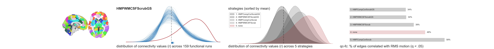
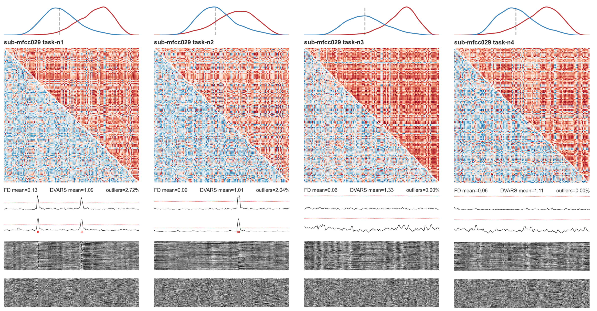

## denoise
> compare different confound regression strategies on measures of functional connectivity (FC) and quality control (QC)
 
  

---

**to run**: `$ python denoise.py --help`  

**description**  

Denoising aims to mitigate the effects of non-neural signals (head motion, repiratory/cardiac effects, and scanner noise) on FC. An [fMRIPrep](https://fmriprep.org/en/stable/)-processed dataset includes a large array of confound estimates, from which a sensible subset can be selected as defined by [load_confounds](https://github.com/SIMEXP/load_confounds). Some predefined strategies are listed in `strategies.py`. 

The efficacy of each strategy is evaluated by estimating the distribution of FC between pairs of nodes, define by the [DiFuMo parcellation](https://parietal-inria.github.io/DiFuMo/), before and after denoising. Skewed distributions with high variability across runs are markers of motion and other non-neural influences on connectivity correlations, and effective denoising should approximately center these distributions. Artifacts affecting signals across large areas of the image can also be visualized with a carpetplot view of all voxels across time. It can be additionally beneficial to exclude runs of data where motion estimates are high. 

To determine the degree that each strategy controls for the effects of movement, QC-FC is computed as the cross-run correlations between mean relative displacement and functional connectivity. This allows for selecting strategies that minimize the number of edges significantly related to motion. 

It should be noted that certain strategies, such as those including the global signal, can agressively minimize non-neural noise but in turn also neural signals. There is no consensus on an optimal strategy, it rather depends on the dataset and research question.

**references**  

Ciric, Rastko, et al. "Benchmarking of participant-level confound regression strategies for the control of motion artifact in studies of functional connectivity." *Neuroimage* 154 (2017): 174-187.  

Power, Jonathan D., et al. "Methods to detect, characterize, and remove motion artifact in resting state fMRI." *Neuroimage* 84 (2014): 320-341.  